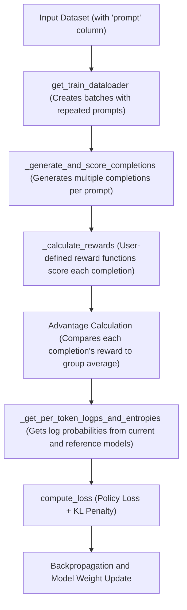
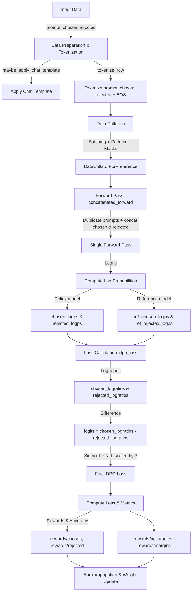

# CODE BREAKDOWN

# 1. GRPOTrainer

```mermaid
flowchart TD
    A["Input Dataset (with 'prompt' column)"] --> B["get_train_dataloader (Creates batches with repeated prompts)"]
    B --> C["_generate_and_score_completions (Generates multiple completions per prompt)"]
    C --> D["_calculate_rewards (User-defined reward functions score each completion)"]
    D --> E["Advantage Calculation (Compares each completion's reward to group average)"]
    E --> F["_get_per_token_logps_and_entropies (Gets log probabilities from current and reference models)"]
    F --> G["compute_loss (Policy Loss + KL Penalty)"]
    G --> H["Backpropagation and Model Weight Update"]
```

# 2. DPO

```mermaid
flowchart TD

    A[Input Data] -->|prompt, chosen, rejected| B[Data Preparation & Tokenization]
    B -->|maybe_apply_chat_template| B1["Apply Chat Template"]
    B -->|tokenize_row| B2["Tokenize prompt, chosen, rejected + EOS"]

    B2 --> C[Data Collation]
    C -->|Batching + Padding + Masks| C1["DataCollatorForPreference"]
    C1 --> D["Forward Pass: concatenated_forward"]

    D -->|Duplicate prompts + concat chosen & rejected| D1["Single Forward Pass"]
    D1 -->|Logits| D2["Compute Log Probabilities"]
    D2 -->|Policy model| D3["chosen_logps & rejected_logps"]
    D2 -->|Reference model| D4["ref_chosen_logps & ref_rejected_logps"]

    D3 --> E["Loss Calculation: dpo_loss"]
    D4 --> E

    E -->|Log-ratios| E1["chosen_logratios & rejected_logratios"]
    E1 -->|Difference| E2["logits = chosen_logratios - rejected_logratios"]
    E2 -->|Sigmoid + NLL scaled by β| E3["Final DPO Loss"]

    E3 --> F["Compute Loss & Metrics"]
    F -->|Rewards & Accuracy| F1["rewards/chosen, rewards/rejected"]
    F --> F2["rewards/accuracies, rewards/margins"]

    F1 --> G[Backpropagation & Weight Update]
    F2 --> G
```