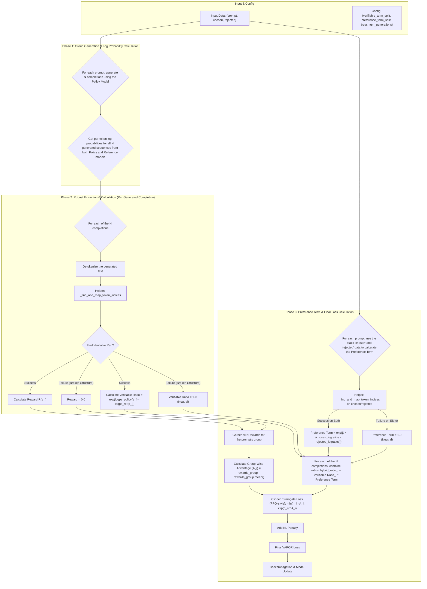

# **Comprehensive Guide to Implementing VAPORTrainer (GRPO-Aligned)**

Welcome! This guide will walk you through implementing the `VAPORTrainer`, a training method that combines the strengths of reward-based optimization (like GRPO) and preference-based optimization (like DPO).

Our goal is to create a trainer that can optimize a Large Language Model based on two signals simultaneously:
1.  **Verifiable Reward:** A quantifiable score on a specific, structured part of the model's *newly generated* outputs. This is calculated using a group-wise approach inspired by GRPO.
2.  **Human Preference:** A choice between two complete, static responses (`chosen` vs. `rejected`) from the input dataset, used to steer the model's style and tone, similar to DPO.

We will implement this using a robust "detokenize-and-search" strategy, which avoids modifying the model's tokenizer but requires careful handling of cases where the model fails to generate the expected structure.

## **1. High-Level Workflow**

The entire process, corrected to reflect the GRPO methodology, can be visualized with the following workflow. Your task is to implement the logic described in this diagram.



---

## **2. `VAPORTrainer` Setup**

### **Configuration (`__init__`)**

Your trainer's `__init__` method should accept the standard arguments (`model`, `tokenizer`, `args`, etc.) plus our new custom configurations:

*   `num_generations (int)`: The number of completions to generate for each prompt to form a group for GRPO-style advantage calculation.
*   `verifiable_term_split (Tuple[str])`: A tuple containing the start and end tags for the verifiable section. Example: `("<REASONING>", "</REASONING>")`.
*   `preference_term_split (Tuple[str])`: A tuple containing the start and end tags for the preference response. Example: `("<RESPONSE>", "</RESPONSE>")`.
*   `beta (float)`: The temperature parameter to control the strength of the preference signal.

### **Data Format**

The trainer expects a dataset where each row contains:
*   `prompt`: The input to the model.
*   `chosen`: The full, preferred completion string. This is used *only* for the preference signal.
*   `rejected`: The full, dispreferred completion string, also used *only* for the preference signal.

---

## **3. Step-by-Step Implementation Guide**

The core logic will be in your `compute_loss` method. Here’s how to build it.

### **Step 3.1: The Helper Function: `_find_and_map_token_indices`**

First, implement the robust extraction utility. This function is critical. It must take a detokenized string, the tokenizer's `offset_mapping` for the corresponding tokens, and the start/end tags. It should return a tuple of `(start_token_index, end_token_index)` or `None` if the structure is broken.

**Why it's important:** This function bridges the gap between the flexible string world (where we find tags) and the rigid token world (which we need for slicing log probability tensors). Handling its `None` output gracefully is the key to a robust trainer.

```python
def _find_and_map_token_indices(full_text, token_offsets, start_tag, end_tag):
    """
    Finds a substring defined by tags and maps it back to token indices.
    Returns None if the structure is broken.
    """
    try:
        start_char_idx = full_text.index(start_tag)
        # Search for the end tag *after* the start tag to ensure correct ordering
        end_char_idx = full_text.index(end_tag, start_char_idx) + len(end_tag)
    except ValueError:
        # One or both tags were not found.
        return None

    start_token_idx, end_token_idx = -1, -1

    for i, (token_start, token_end) in enumerate(token_offsets):
        # Skip padding tokens which have (0, 0) offsets
        if token_end == 0:
            continue
        
        # Find the first token that starts at or after our desired text span
        if start_token_idx == -1 and token_start >= start_char_idx:
            start_token_idx = i
        
        # Find the last token that ends at or before our desired text span
        if start_token_idx != -1 and token_end <= end_char_idx:
            end_token_idx = i
        
        # If we have moved past our desired text, we can stop
        if token_start > end_char_idx:
            break

    # Validate that we found a valid token range
    if start_token_idx == -1 or end_token_idx == -1 or end_token_idx < start_token_idx:
        return None

    # Return the slice-ready indices (end index is inclusive in logic, so +1 for slicing)
    return (start_token_idx, end_token_idx + 1)
```

### **Step 3.2: `compute_loss` Main Logic**

This function orchestrates the entire process for a given batch of prompts.

1.  **Generate Multiple Completions:**
    *   For each `prompt` in the batch, use the policy model (`self.model`) to generate `self.num_generations` responses. This creates a group of samples for each original prompt.

2.  **Get Log Probs for Generated and Preference Data:**
    *   **Generated:** Perform a forward pass for all generated completions to get their log probabilities from both the `policy` and `reference` models.
    *   **Preference:** Perform a separate forward pass on the static `chosen` and `rejected` sequences from the input batch to get their log probabilities, which will be used for the DPO-style preference term.

3.  **Initialize Storage:**
    *   Create lists to store results for the generated completions: `all_rewards = []`, `all_verifiable_ratios = []`.

4.  **Loop Through Generated Completions (Process Verifiable Term):**
    *   Iterate through each generated completion.
    *   **Decode:** Detokenize the sequence.
    *   **Extract:** Call your helper function `_find_and_map_token_indices` to find the verifiable part using `self.verifiable_term_split`.
    *   **Handle Failure:**
        *   If extraction fails (`None`): set `reward = 0.0` and `verifiable_ratio = 1.0` (a neutral multiplier).
        *   If successful:
            *   Extract the verifiable text and calculate the `reward` using your reward function.
            *   Calculate the `verifiable_ratio` using the log probabilities of the tokens within the extracted slice: `exp(logps_policy - logps_ref)`.
    *   Append the `reward` and `verifiable_ratio` to your lists.

5.  **Calculate Group-Wise Advantage:**
    *   Reshape the `all_rewards` list into a tensor of shape `(batch_size, num_generations)`.
    *   Calculate the mean reward for each group (prompt): `mean_rewards = rewards_tensor.mean(dim=1, keepdim=True)`.
    *   Calculate advantage for every completion: `advantages = rewards_tensor - mean_rewards`.

6.  **Calculate Preference Term (Once Per Prompt):**
    *   For each prompt in the original batch:
    *   **Extract for Both:** Call the helper function on the `chosen` and `rejected` text to find their preference response indices (`chosen_pref_indices`, `rejected_pref_indices`).
    *   **Handle Failure:**
        *   If either extraction fails: set `preference_term = 1.0` (neutral).
        *   If both succeed:
            *   Calculate the DPO-style log-ratios for the `chosen` and `rejected` slices.
            *   `log_ratio_diff = (chosen_policy_logps - chosen_ref_logps) - (rejected_policy_logps - rejected_ref_logps)`.
            *   `preference_term = exp(self.beta * log_ratio_diff)`.
    *   You will have one `preference_term` per original prompt.

7.  **Assemble the Final Loss:**
    *   Reshape the `all_verifiable_ratios` list into a tensor of shape `(batch_size, num_generations)`.
    *   Expand the `preference_terms` tensor so it can be broadcast and multiplied with the verifiable ratios. The shape should become `(batch_size, 1)`.
    *   `hybrid_ratios = verifiable_ratios_tensor * preference_terms_tensor`.
    *   Calculate the PPO clipped surrogate objective using the flattened `hybrid_ratios` and `advantages`.
    *   Add the KL penalty between the policy and reference models for the generated completions.
    *   This is your final VAPOR loss.

By following these steps, you will create a robust `VAPORTrainer` that correctly implements the GRPO group-wise advantage calculation for the reward signal while seamlessly integrating the DPO-style preference signal.

## **4. The Math**
We propose a new hybrid objective, which we will call **Verifiable Advantage and Preference Optimization Ratio (VAPOR)**. This approach maintains a single-loss structure while seamlessly embedding both verifiable reward and preference signals through a unified probability ratio.

Let's first define our variables for clarity:
-   $p$: The input prompt.
-   $s_i$: The verifiable part of the generation (`REASONING`, `INTENT`, `EMOTION`) on which the reward function is applied.
-   $(y_w, y_l)$: The pair of preferred (winner) and dispreferred (loser) responses associated with the prompt $p$ and verifiable output $s_i$.

The core of our proposal is a new, preference-aware probability ratio, $r'_{i(\theta)}$, which combines both verifiable reward-based and preference-based optimization signals.

### **4.1. The Hybrid Probability Ratio**

The refined probability ratio $r'_i(\theta)$ is a product of two terms: a verifiable reward term that captures structured generation quality and a preference term that incorporates human feedback.

It is formulated as follows:

$$r'_i(\theta) = \underbrace{\left( \frac{\pi_\theta(s_i|p)}{\pi_{\text{ref}}(s_i|p)} \right)}_{\text{Verifiable Reward Term}} \cdot \underbrace{\exp\left( \beta \left( \log \frac{\pi_\theta(y_w|p, s_i)}{\pi_{\text{ref}}(y_w|p, s_i)} - \log \frac{\pi_\theta(y_l|p, s_i)}{\pi_{\text{ref}}(y_l|p, s_i)} \right) \right)}_{\text{Preference Term}}$$

Let's deconstruct the novel **Preference Term**:

-   **Log-Probability Ratios**: The terms $\log\left(\frac{\pi_\theta(y|p, s_i)}{\pi_{\text{ref}}(y|p, s_i)}\right)$ measure how much the current policy $\pi_\theta$ has shifted the log-probability of generating a response $y$ compared to the reference policy $\pi_{\text{ref}}$.
-   **Preference Difference**: We take the difference between the log-ratio for the *winning* response ($y_w$) and the log-ratio for the *losing* response ($y_l$).
    -   If this difference is positive, it means the policy is correctly increasing the likelihood of $y_w$ relative to $y_l$, which is the desired behavior.
    -   If it is negative, the policy is incorrectly favoring the dispreferred response.
-   **Exponentiation**: We wrap the entire expression in $\exp(\cdot)$ to convert the log-domain difference back into a non-negative, multiplicative ratio. This makes it compatible with advantage-based optimization, where it will scale the advantage $A_i$.
-   **The $\beta$ Hyperparameter**: This temperature parameter provides explicit control over the strength of the preference signal.
    -   A higher $\beta$ will amplify the effect of the preference data.
    -   Setting $\beta = 0$ makes the entire preference term equal to 1, effectively reducing to pure verifiable reward-based optimization.
    -   This provides fine-grained control over the balance between verifiable reward and preference signals.

###  **4.2. The Final VAPOR Objective Function**

With this new hybrid ratio, the final objective function remains a single, unified loss that elegantly balances verifiable reward-based and preference-based learning through structured optimization.

The final **VAPOR** objective is:

$$\mathcal{L}_{\text{VAPOR}}(\theta) = \mathbb{E} \left[ \min \left( r'_i(\theta) A_i, \text{clip} \left( r'_i(\theta), 1-\varepsilon, 1+\varepsilon \right) A_i \right) \right] - w_1 \mathbb{D}_{\text{KL}}(\pi_\theta \| \pi_{\text{orig}})$$

Here, the advantage $A_i$ is calculated based on the reward from the verifiable output $s_i$, but its application is now scaled by both the verifiable reward-based probability ratio and the preference-based ratio, creating a unified optimization signal that respects both verifiable feedback and human preferences.
</vapor>